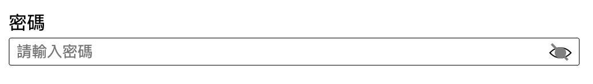

<h1 align="center">SihRong-package-demo</h1>

<p align="center">
SihRong package demo for vue conf workshop.
</p>

<p align="center">
  <a target="_blank" href="https://www.npmjs.com/package/sihrong-package-demo">
    
  </a>
  <a target="_blank" href="https://vuejs.org/" title="vue">
      
  </a>
  <a target="_blank" href="http://nodejs.org/download/" title="Node version">
      
  </a>
  <a target="_blank" href="https://github.com/MikeCheng1208/vue-metamask/pulls" title="PRs Welcome">
      
  </a>
</p>

<p align="center">
<a target="_blank" href="https://www.npmjs.com/package/sihrong-package-demo">
  
</a>
</p>


## 🚀 Features

- 🎪 **Support for Vue 3** 
- 🦾 **Simple and user-friendly UI components**
- 🔋 **Develop the integration of UnoCSS (optional)**
- 🔩 **Compatible with cjs, es, and iife versions**
- 🌎 **Documentation available：** [中文](./zh-tw/README.md) | English


### 📦 Installation
```
npm install sihrong-package-demo -S
```


### 🕶 Style
```javascript
import 'mike-vue-ui/dist/index.css';
```

## ⚡ Components

<!-- <details> -->
  <h5> password Input</h5>

  ## password input
  - Specialized input for password, provide display password switching  .

  
  <br/>

```javascript
import { PasswordInput } from "sihrong-package-demo";

const message = ref("");

  // 非必要,string
const width = ref('100px');
```

```html
   <password-input v-model="message" width="width"></password-input>
```
<!-- </details> -->


## License

[MIT](./LICENSE) License &copy; 2023-PRESENT [Cheng-sih-rong](https://github.com/Cheng-sih-rong)
